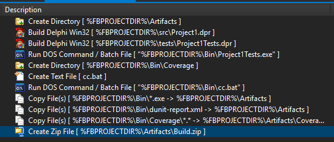

# Configuração do Script

## Compilação Básica

1. Create Directory

```
  New directory name: %FBPROJECTDIR%\Artifacts
  [x] Force directories
```

2. Build Delphi Win32

```
  Project file: %FBPROJECTDIR%\src\Project1.dpr
  Compiler version: <sua versão do Delphi>
  Options source: [x] Load settings from project file: [x] marcar todas as abaixo 
```

3. Copy File(s)

```
  Source: %FBPROJECTDIR%\Bin\*.exe
  Destination: %FBPROJECTDIR%\Artifacts
```

4. Create Zip File

```
  Output File: %FBPROJECTDIR%\Artifacts\Build.zip 
  Root Directory: %FBPROJECTDIR%\Artifacts
  Files: *.*
```

## Compilação com DUnit

1. Build Delphi Win32

```
  Project file: %FBPROJECTDIR%\tests\Project1Tests.dpr 
  Compiler version: <sua versão do Delphi>
  Options source: [x] Load settings from project file: [x] marcar todas as abaixo 
```

2. Run DOS Command

```
  Command: "%FBPROJECTDIR%\Bin\Project1Tests.exe" 
  Start in: %FBPROJECTDIR%\Bin\
```

3. Copy File(s)

```
  Source: %FBPROJECTDIR%\Bin\dunit-report.xml
  Destination: %FBPROJECTDIR%\Artifacts
```

## Compilação com Code Coverage

1. Create Directory

```
  New directory name: %FBPROJECTDIR%\Bin\Coverage
  [x] Force directories
```

2. Create Text File

```
  New file location: %FBPROJECTDIR%\Bin\cc.bat
  File contents: "%FBPROJECTDIR%\Coverage\CodeCoverage.exe" -e "%FBPROJECTDIR%\Bin\Project1Tests.exe" -m "%FBPROJECTDIR%\Bin\Project1Tests.map" -sd "%FBPROJECTDIR%\src" -u uCalculadora.pas -html -emma -xml -od "%FBPROJECTDIR%\Bin\Coverage"
```

3. Run DOS Command

```
  Command: "%FBPROJECTDIR%\Bin\cc.bat"
  Start in: %FBPROJECTDIR%\Bin
```

4. Copy File

```
  Source: %FBPROJECTDIR%\Bin\Coverage\*.*
  Destination: %FBPROJECTDIR%\Artifacts\Coverage
```
## Preview

